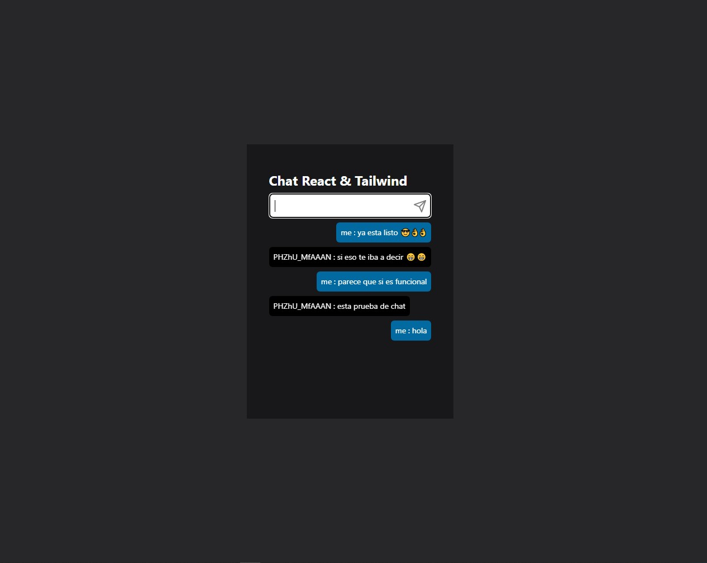

# server chat

  Hola 🙋‍♂️ I am Richard.

## Descripción

- Chat Básico pero base suficiente para escalar (tu imaginación es el limite)

## Tecnologías

- Node
- React
- Socket.io
- Sokect.io-client
- Tailwind

## Notas

- script para hacer build del cliente en heroku:

      "build": "npm --prefix client install && npm run --prefix client build"

- `mongan` - muestra en consola las peticiones que hace el servidor con detalles de esta

## Vista Previa y Enlace en linea

[Vista Previa](https://cool-chat-87a5e9.netlify.app/)

